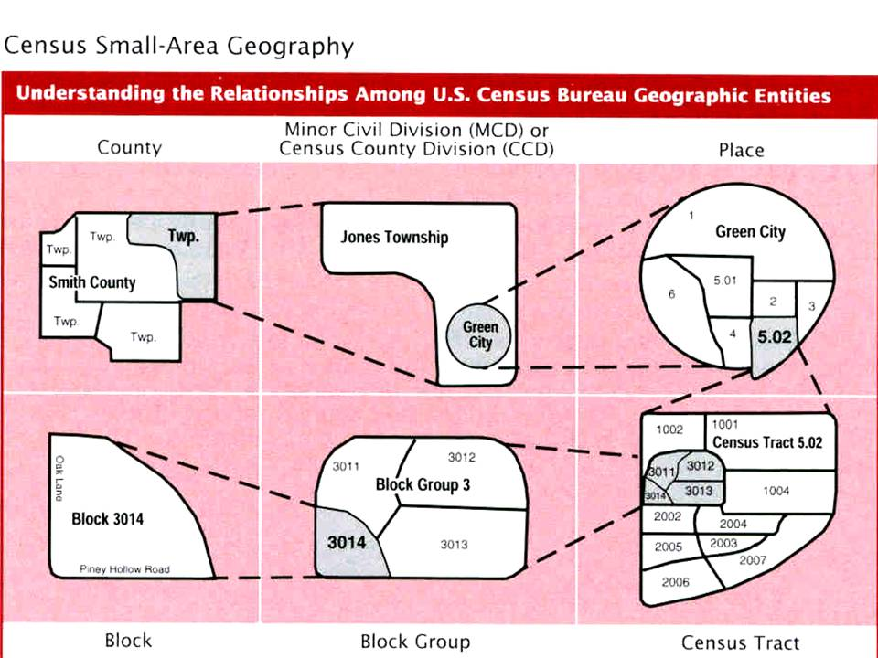

# TIGER/Line Geodatabases

[TIGER/Line Geodatabases](https://www.census.gov/geographies/mapping-files/time-series/geo/tiger-geodatabase-file.2022.html)

[2008 TIGER/Line Shapefiles Technical Documentation](https://www2.census.gov/geo/pdfs/maps-data/data/tiger/tgrshp2008/TGRSHP08.pdf)

[MAF/TIGER Feature Class Code Definitions](https://www.census.gov/library/reference/code-lists/mt-feature-class-codes.html)

[Collecting and Maintaining our Geographic Data](https://www.census.gov/newsroom/blogs/random-samplings/2012/08/collecting-and-maintaining-our-geographic-data.html)

## Understanding

[US Census Bureau Geographic Entities and Concepts](https://www.census.gov/content/dam/Census/data/developers/geoareaconcepts.pdf)

> **Census Tracts**
> * Small, permanent, consistent statistical divisions of a county
> * Optimally contains 4,000 people; range between 1,200 and 8,000
>
> **Block Groups**
> * Smallest units for tabulation of sample data
> * Population ranges from 600 to 3,000
>
> **Blocks**
> * Smallest units for 100% data tabulation
> * Cover entire nation
> * Nest within all other types of geographic areas
> * Generally bounded by visible features or boundaries

### [United States Census Information @ Pitt](https://pitt.libguides.com/uscensus)

* [Census Geography](https://pitt.libguides.com/uscensus/understandinggeography)

> **Geographic Hierarchy**
> 
>  
> The Standard Hierarchy of Census Geographic Entities (also available as a PDF
> below) shows the many geographic types for which data are available from the
> U.S. Census Bureau.
>  
>  
> With connecting lines, the diagram shows the hierarchical relationships
> between geographic types. For example, a line extends from states to counties
> because a state is comprised of many counties, and a single county can never
> cross a state boundary.
>  
>  
> If no line joins two geographic types, then an absolute and predictable
> relationship does not exist between them.
>  
>  
> For example, many places are confined to one county. However, some places
> extend over more than one county, such as New York City. Therefore, an
> absolute hierarchical relationship does not exist between counties and
> places, and any tabulation involving both these geographic types may
> represent only a part of one county or one place.
>  
>  
> Notice that many lines radiate from blocks, indicating that most geographic
> types can be described as a collection of blocks, the smallest geographic
> unit for which the Census Bureau reports data. However, only two of these
> lines also describe the path by which a block is uniquely named. That is, the
> path through the Block Group or through the Tribal Block Group.

## Accuracy

* [WISCONSIN GEOSPATIAL NEWS: CENSUS ACCURACY IMPROVEMENT PROJECT MOVING FORWARD](https://www.sco.wisc.edu/2005/07/26/census-accuracy-improvement-project-moving-forward/)

* [tgrshp2022](https://www2.census.gov/geo/pdfs/maps-data/data/tiger/tgrshp2020/)
  * [3. About the 2022 TIGER/Line Shapefiles](https://www2.census.gov/geo/pdfs/maps-data/data/tiger/tgrshp2022/TGRSHP2022_TechDoc_Ch3.pdf)

* [US Census MAF/TIGER Accuracy Improvement Project (MTAIP)](https://hazards.fema.gov/femaportal/docs/TIGER_2007.pdf)

  > The US Census Bureau is realigning the street features in a portion of the
  > nation's counties or statistically equivalent entities each year until all
  > counties are completed in 2008.

